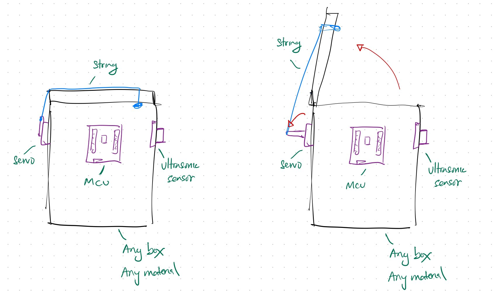

# UoSM Robotics Club Smart Dustbin

This repository contains the Arduino-based smart dustbin used for the UoSM Robotics Club recycling workshop. The bin uses an ultrasonic sensor to detect nearby objects and a servo motor to open and close the lid automatically.

  

## What you need

- Arduino Uno / Maker Uno
- SG90 servo motor
- HC-SR04 ultrasonic sensor
- Breadboard
- Male-to-male and male-to-female jumper wires
- Recycled materials for the dustbin body and lid

## Setup

1. Build the dustbin structure and mount the electronics on it.
2. Connect the power rails on the breadboard to 5V and GND.
3. Wire the ultrasonic sensor:
   - VCC to 5V
   - GND to GND
   - TRIG to A5
   - ECHO to A4
4. Wire the servo motor:
   - VCC to 5V
   - GND to GND
   - Control wire to pin 13
5. Install the Arduino Servo library in the Arduino IDE if it is not already available.
6. Upload `Recycle_Bot_code/Recycle_Bot_code.ino` to the board.

## How to operate

1. Power the board through USB or another suitable power source.
2. Keep the lid clear so the servo can move freely.
3. Move a hand or object within about 10 cm of the ultrasonic sensor.
4. The servo should lift the lid open.
5. Move the object away and the lid should close again.

## Notes

- The current code keeps the lid open while an object is detected within 10 cm.
- The servo may draw more current than a weak USB port can provide, so use a stable 5V supply if the lid movement is unreliable.
- If the lid does not move correctly, check the wiring and servo orientation first.
